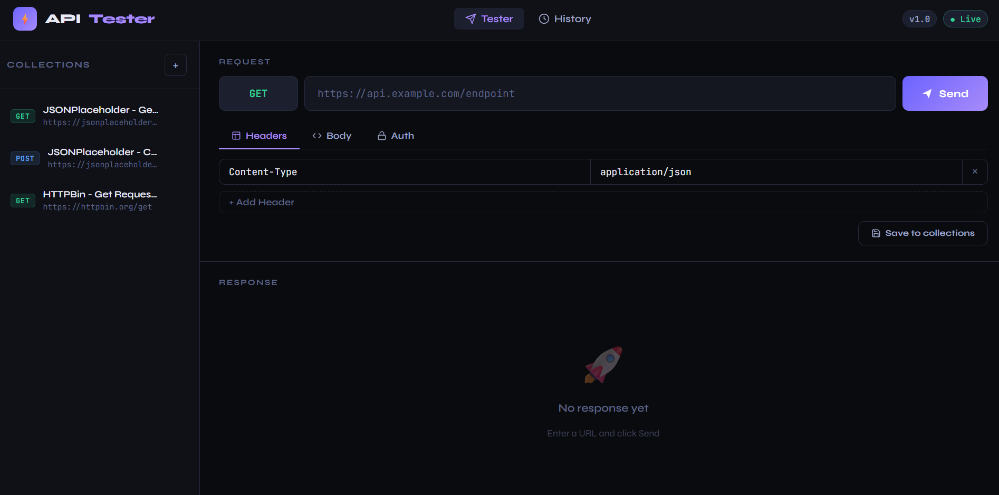
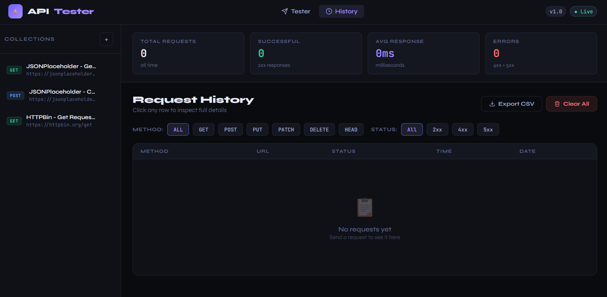
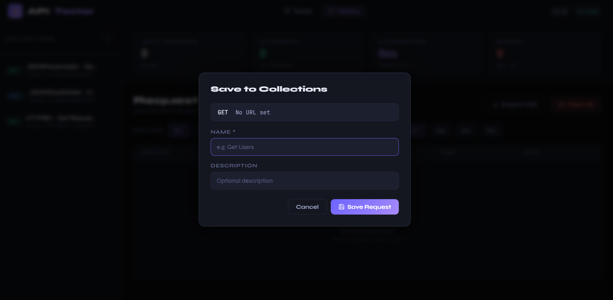

# ⚡ API Tester & Request Logger

A lightweight, Postman-inspired API testing tool built with **PHP**, **MySQL**, and **Vanilla JS**. Test any REST API endpoint, log every request, and save your favorites — all from your browser.


---

## ✨ Features

- **Full HTTP Support** — GET, POST, PUT, PATCH, DELETE, HEAD
- **Request Builder** — custom headers, JSON body, Bearer auth token
- **JSON Syntax Highlighting** — color-coded response viewer
- **Request History** — every request saved to MySQL with filters
- **Collections** — save & reuse your favorite requests
- **Stats Dashboard** — total requests, success rate, avg response time
- **Export CSV** — download your request history
- **Detail Drawer** — inspect full request/response for any log entry
- **Dark Terminal UI** — built for developers, by a developer

---

## Live Website link
https://www.api-tester.infinityfreeapp.com

---

## 📸 Screenshots


---


---


---

## 🚀 Quick Setup (XAMPP)

### 1. Clone the repository
```bash
git clone https://github.com/yourusername/api-tester.git
```

### 2. Move to htdocs
```
C:\xampp\htdocs\api-tester\
```

### 3. Create the database
- Open `http://localhost/phpmyadmin`
- Create a new database called `api_tester`
- Import `database.sql`

### 4. Configure database credentials
Edit `config/database.php`:
```php
define('DB_HOST', 'localhost');
define('DB_USER', 'root');
define('DB_PASS', '');       // your MySQL password
define('DB_NAME', 'api_tester');
```

### 5. Open in browser
```
http://localhost/api-tester/
```

---

## 📁 Project Structure

```
api-tester/
├── config/
│   └── database.php        ← DB connection (do not commit with credentials)
├── src/
│   ├── request.php         ← cURL HTTP sender + logger
│   └── collections.php     ← Save/load collections
├── assets/
│   ├── css/style.css       ← Full dark theme stylesheet
│   └── js/app.js           ← Frontend JS application
├── api.php                 ← AJAX endpoint handler
├── index.php               ← Main application view
├── database.sql            ← DB schema + sample data
└── README.md
```

---

## 🛠 Tech Stack

| Layer      | Technology               |
|------------|--------------------------|
| Backend    | PHP 8.0+ with cURL       |
| Database   | MySQL 8.0 via PDO        |
| Frontend   | Vanilla JS (no frameworks)|
| Styling    | Custom CSS (no Bootstrap) |
| Fonts      | JetBrains Mono + Syne    |

---

## 🔒 Security Notes

- Uses **PDO prepared statements** to prevent SQL injection
- **Never commit** `config/database.php` with real credentials
- Add `config/database.php` to `.gitignore` in production

---

## 📄 License

MIT License — free to use, modify, and distribute.

---

## 👤 Author

Built by **[Rashedul islam]** — [GitHub](https://github.com/root-rashed) · [LinkedIn](https://linkedin.com/in/root-rashed)
